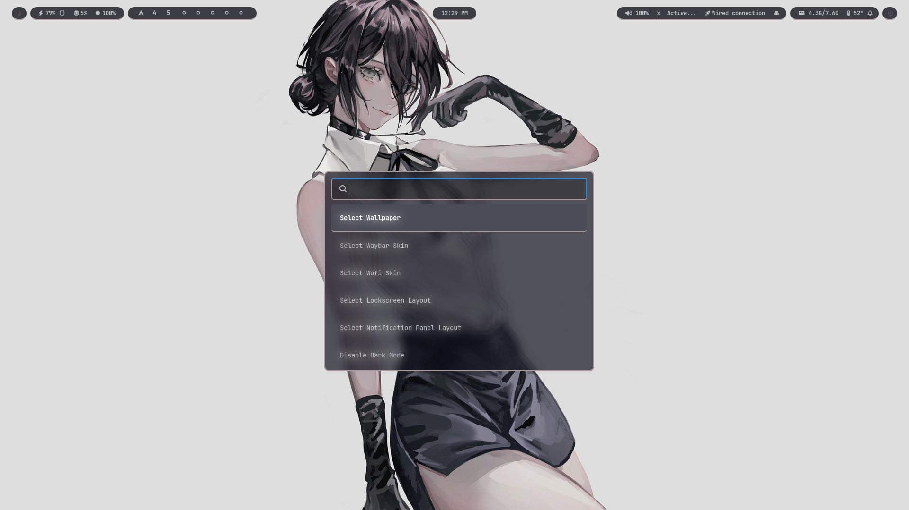

## Theming

bash scripts that are relevant to theming are:
- `bin/customize` which handles modifying the config files to import from the selected active skin.
- `bin/quick-theme` which wraps `customize` as a quick way to apply skins for every supported package; and
- the scripts at `.config/hypr/scripts/wallpapers` and `.config/themes/THEME/theme.sh`
 

Depending on the package, the relevant files that make the Skins system work may vary. Make sure to analyze the directory structure of the following `.config` folders:
- `.config/waybar/`
  - The root `config.jsonc` and `style.css` imports from the active skin.
- `.config/hypr/hyprlock/`
  - `hyprlock.conf` in `hypr` imports from the active hyprlock skin.
- `.config/hypr/swaync/`
  - `json`(s) can't import, so `bin/customize` copies the contents of the active skin's `config.json` file over to the root `config.json` file.
  - `style.css` imports from the active skin.
- `.config/rofi`
  - `config.rasi` imports from the active skin.
 

The directory structure of Skins are always `.config/PACKAGE/skins/SKIN/CONTENT`.

You usually have two options when making a Skin:
- Install someone else's packge design/setup and then manually adjust its files to follow the directory and file organization schematics; or
- Make your own. ¯\_(ツ)_/¯
  - Make sure it supports the Dark and Light contrast modes by importing from wallust: `/home/username/.cache/wallust/your-wallust-colors.extension`
 
 

 
 
 
 
 
 
 
 
 
 
 
